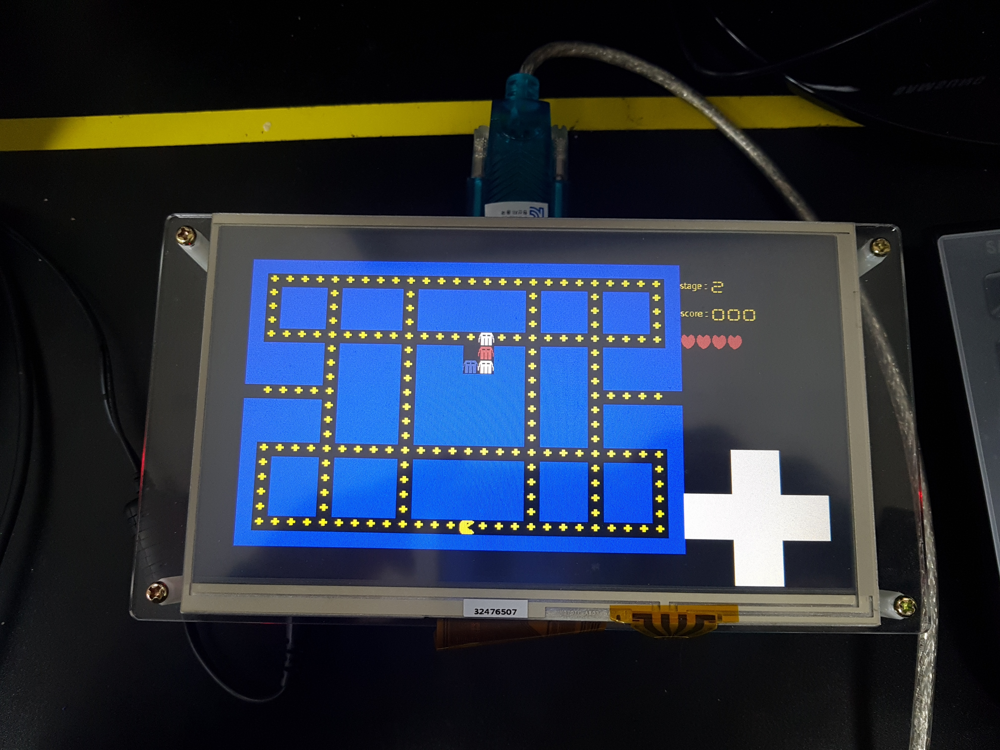
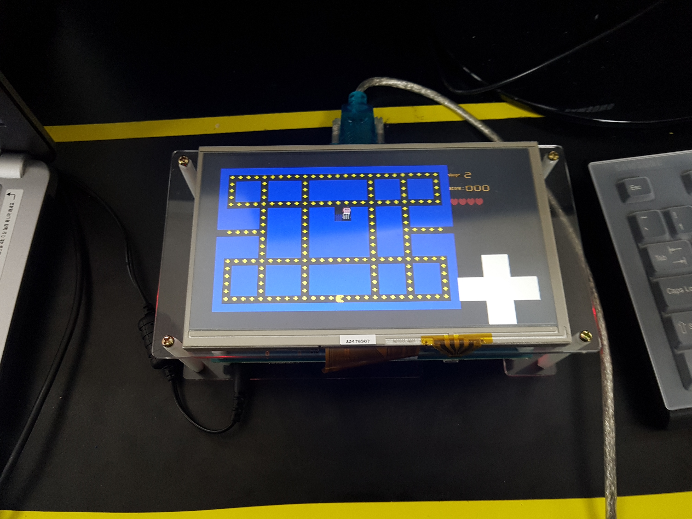
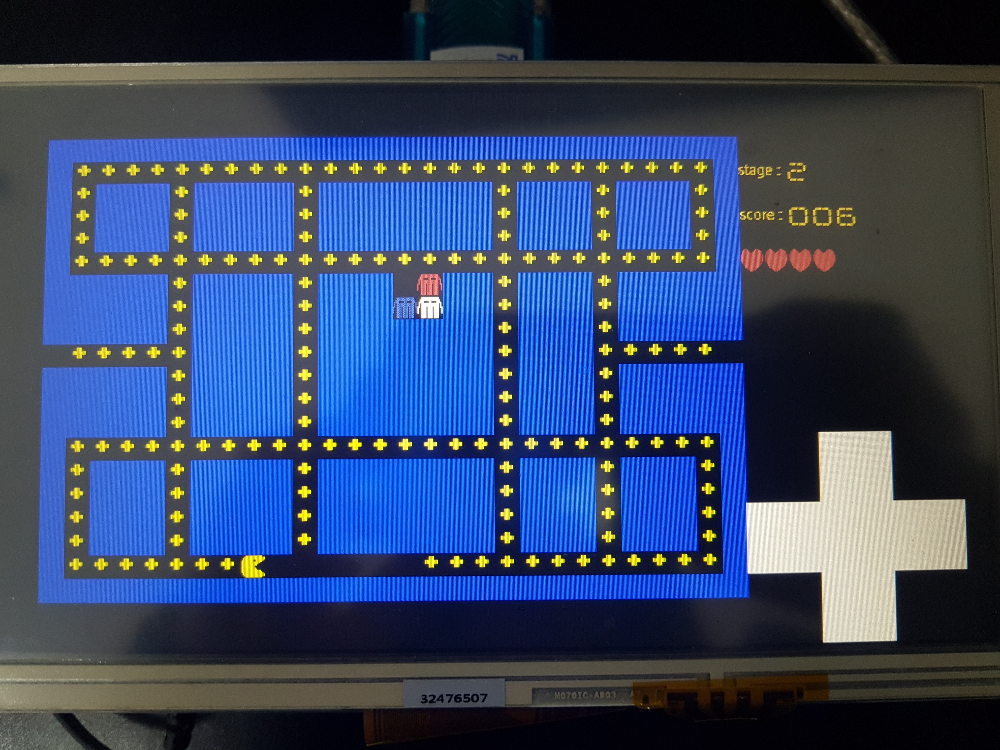

# Pacman game for [mangoboard](https://www.icbanq.com/icdownload/data/ICBShop/Board/Mango%20CM-V310%20Premium%20Package%203%20Exynos%204210%20S5PV310%20EVB%20.pdf)
> CSED211
> 김근우, 김선표, 김승환

## Start

Compile the souce code

```sh
$ Make
```

Upload the compiled binary on mangoboard. After bootelf, you can see the main menu from terminal you can choose **1. Start game** or **2. Exit**. Choose **1. Start game** then the pacman game will start.

## How to play the game

You can move your pacman by arrow which is at right side of screen. And also you can see the score, remained life and round information at the top. You can also change the level of the round by pushing buttons under the screen.

## Demo








## Report

### General structure
```c=
typedef enum type_
{
  WALL,
  BACK,
  COIN
}type;
```
우선 맵을 행렬로 block화 하는 과정을 진행했다. 20 x 28 배열로 정의하였고 한 block은 20 x 20 pixel로 정의하였다. 그래서 한 block의 type을 enum으로 정의해주었다.
```c=
typedef struct pos_
{
  int x;
  int y;
}pos;
```
pacman과 ghost의 위치를 structure를 만들어서 저장해주었다. 여기서 x, y는 map의 정보를 저장하는 배열의 행과 열에 관한 정보이다.
```c=
typedef struct block_
{
  type block_type;
}block;
```
하나의 block은 modulation을 위해서 `block` structure로 정의하였다.
```c=
typedef enum
{
	UNDEF,
	UP,
	DOWN,
	LEFT,
	RIGHT
}way;
```
touch pad로 방향을 입력받을 때 방향을 저장하기 위해 사용되는 enum이다. 이는 `pacman.c`에 정의된 define 변수와 일치한다. `way` structure는 touch pad입력을 받기위해 사용되고 define 변수는 실질적으로 pacman을 움직이기 위해서 사용된다.
### Global variable
```c=
#define MAX_LIFE 5
#define MAX_COIN 180
extern way direct;
extern mov_stat;
int round = 4;

int start = 0;	// If 1 then, start mode
int biology = MAX_LIFE;
unsigned int count = 0;
int c_count = MAX_COIN;// Needed to edit

block map[20][28];
pos pacman;
pos enemy[4];
```
우선 round를 저장하는 변수를 하나 만들었고 test의 편의로 위해서 4를 default로 해놨다. `start`는 처음에 start하기전에 touch interrupt가 한번 오면 start하도록 하려했는데 실직적으로는 구현하지 않았다. `biology`는 현재 가지고 있는 목숨을 저장하는 변수이다. count는 timer대신 도입한 것으로 while문이 한 번 돌면 1증가한다. count를 가지고 얼마의 주기로 화면을 갱신할지 결정한다. 이를 통해 난이도 구현이 가능하다. `c_count`는 coin의 갯수로 맵에 있는 coin의 갯수를 저장하다. 점수를 계산하기 위해 사용되는 변수이다. `map`은 pacman game이 진행되는 map에 관한 정보를 저장하고 있는 배열이다.
`pacman`과 `enemy`는 현재 pacman과 ghost의 위치를 저장하고 있다.

### Button
```
static int level_travel()
{
	int len;
  char buf;
 
  len = mango_uart_read(&buf, 1, 1);
  if (len > 0)
    return 0;
     
	MANGO_BTN_STATE up = mango_btn_scan(MANGO_BTN_KEYCODE_UP);
	MANGO_BTN_STATE down = mango_btn_scan(MANGO_BTN_KEYCODE_DOWN);
	MANGO_BTN_STATE left = mango_btn_scan(MANGO_BTN_KEYCODE_LEFT);
	MANGO_BTN_STATE right = mango_btn_scan(MANGO_BTN_KEYCODE_RIGHT);


  if (up == MANGO_BTN_STATE_DOWN){
						round++;
            printf("Up key pressed\n");
						return 1;
				}
       
        if (down == MANGO_BTN_STATE_DOWN){
						round--;
            printf("DOWN key pressed\n");
						return 2;
				}

        if (left == MANGO_BTN_STATE_DOWN)
            printf("LEFT key pressed\n");

        if (right == MANGO_BTN_STATE_DOWN)
            printf("RIGHT key pressed\n");


        if (up == MANGO_BTN_STATE_UP)
            printf("Up key released\n");
       
        if (down == MANGO_BTN_STATE_UP)
            printf("DOWN key released\n");

        if (left == MANGO_BTN_STATE_UP)
            printf("LEFT key released\n");

        if (right == MANGO_BTN_STATE_UP)
            printf("RIGHT key released\n");
		return 0;
}
```
button이 눌렸는 지 확인하고 눌렸다면 round를 조절한다.
### Interrupt
#### Timer interrupt
```c=
void mango_timer_init(void){
  int i;

  TCFG0_REG = (TCFG0_REG & ~(0xff)) | 0x20; //Prescaler 0: 0x21:32
  TCFG1_REG = (TCFG1_REG & ~(0xf<<4)) | (1<<4); //divider MUX1: 1/2

  //One interrupt per one second
  TCNTB1_REG = 1000000;
  //TCMPB1_REG = 0xffff - 1;

  TCON_REG |= (1<<9); //Timer1 Manual update
  TCON_REG = (TCON_REG & ~(0xf<<8)) | (1<<11) | (1<<8);
  //Timer1 Auto-reload on & Timer1 on

  //Enable interrupt for timer1
  //VIC0INTENABLE_REG |= BIT_TIMER1;
  //TINT_CSTAT_REG |= BIT_TIMER1_EN;

  //Set address of interrupt handler for timer1
  VIC0VECTADDR24 = (unsigned)timer1InterruptServiceRoutine;
}
```
원래 의도는 timer interrupt를 통해서 한 clock마다 pixel을 갱신해줄 생각이었다. 하지만 timer interrupt가 생각보다 느렸고 화면 로딩 속도 또한 느려서 fame이 많이 끊겼고 timer interrupt는 구현은 했지만 사용하지 않았다. 그래픽을 출력해주는 lib을 따로 만들었고 출력 후 
```c=
  set_wincon0_enable();
  set_vidcon0_enable();
```
를 통해서 고정해주었다. 그래픽 출력은 Memory mapping 방법을 사용하였다.
#### Touch interrupt
```c=
void touchInterruptServiceRoutine2(void){
  unsigned int temp;
  unsigned int x, y, rx, ry;

  if( !(VIC1RAWINTR_REG & 1<<31) )
    return;

  /* Disable any other interrupt */
  temp = VIC1INTENABLE_REG;
  VIC1INTENCLEAR_REG = 0xffffffff;

  while( !(readl(ADCCON) & 1<<15) );
  
  x = readl(ADCDAT0) & 0x3ff;
  y = readl(ADCDAT1) & 0x3ff;

  rx = (x - 200) * 800 / 640;
  ry = (y - 340) * 480 / 360;

  printf("(%d, %d)\n", rx, ry);
 
	if((rx <= 33*20) && (rx >= 30*20)) {//left
		direct = LEFT;
		printf("LEFT\n");
	}
	else if((rx<=39*20) && (rx>=36*20)) {//right
		direct = RIGHT;
		printf("RIGHT\n");
	}
	else if((ry>=15*20) && (ry<=18*20)) {//up
		direct = UP;
		printf("UP\n");
	}
	else if((ry>=21*20) && (ry<=24*20)) {//down
		direct = DOWN;
		printf("DOWN\n");
	}

  writel(0xd3, ADCTSC);
  writel(0x1, ADCCLRINT);
    
  /* Enable other interrupts */
  VIC1INTENABLE_REG = temp;
}
```
Touch interrupt는 다음과 같이 interrupt를 받았을 때, x와 y의 값을 가져와서 방향키중에서 어떤 것이 눌렸는 지 판단한다. 그리고 전역변수로 `direct`를 선언해 놓았는데, touch를 받았을 때, 방향을 판단해서 이 변수안에 ENUM으로 잘 채워준다. 이 변수는 `main()`에서 pacman을 움직이는 데  사용된다.
### Main function
```c=
...
	while(1)
	{
	  printf ("\nMain menu\n");
		printf( "1> Start Game\n");
		printf("2> Exit\n");
		c = getchar();
		printf("\n%c is selected\n", c);

		switch(c){
		case '1':
  		mango_menu_main();
			printf("Game start\n");
			break;
		case '2':
			goto finished;
		default:
			printf("Invalid button\n");
		}
	}
	finished:
...
```
다음은 처음에 진입하는 rountine이다. terminal에 게임을 시작할지 종료할지 물어보고 input에 따라 동작을 결정한다. 종료할 때, goto를 사용한 이유는 switch문과 while문을 동시에 빠져 나가기위함이다.
```c=
void main_init(void)
{
	int i, j;
	unsigned int *ph = FB_ADDR;
	for (i = 0; i < 480; i++)
		for(j = 0; j <800;j++)
			ph[i*800+j]=0x000000;
	

	/* Initiallize all the map to indicate BACK */
	for (i = 0; i < 20; i++)
		for (j = 0; j < 28; j++)
		{
			map[i][j].block_type = WALL;
		}
	
	//Positioning pacman and enemy
	pacman.x = 18;
	pacman.y = 14;
	enemy[0].x = 6;
	enemy[0].y = 14;
  enemy[1].x = 7;
  enemy[1].y = 14;
  enemy[2].x = 6;
  enemy[2].y = 15;
  enemy[3].x = 7;
  enemy[3].y = 15;
  map[6][14].block_type = BACK;
	map[7][14].block_type = BACK;
	map[6][15].block_type = BACK;
	map[7][15].block_type = BACK;

	//Positioning COIN and WALL
	coin_init();	

	// Draw controller
	print_controller();
}
```
다음은 게임을 시작하기 전 Initillazing을 진행해주는 함수이다. 우선 모든 화면을 검정색으로 초기화 해주고 모든 map을 벽으로 설정한다. 그리고 ghost와 pacman의 위치를 지정해준 후, 맵에서 코인의 위치를 지정해준다. 코인의 위치에 어차피 길이 있을 것이므로 pacman이 코인을 먹으면 해당 위치를 background로 바꿔준다.

```c=
void mango_menu_main(void){

	pos prev_enemy[4];
	pos prev_pacman;

	int check_valid, i;
	int level;
	if(round == 1)
		level = 50;
	else if(round == 2)
		level = 25;
	else if(round ==3)
		level = 10;
	else
		level = 2; 
	//Print first face

	startnew:
	//print map
	while(1){
	c_count = MAX_COIN;
	//Prepare new stage
	main_init();
	draw_map();
	print_stage(round);
	while(1)
	{
		if(level_travel())
			break;
		print_life(biology);	
		print_score(MAX_COIN - c_count);
		
		/* Check win */
		if(c_count == 0){
			round++;
			if(round == 5){ // clear the game
				biology = 1;
				break;
			}
			goto startnew;
		}
				
		if(count % level == 0)
			if(direct != UNDEF)
				mov_stat = direct;

		if(count % (level*2) == 0) 
		{
        
			...
            
		count = ++count % 1000;

	}
	biology--;
	if(biology == 0){
		printf("Game over\n");
		break;
	}
	}
}
```
다음 함수가 게임이 시작되었을 때, 실질적으로 불리는 main함수이다. 우선 round에 따라서 난이도를 설정해준다. 난이도가 높을 수록 한 frame을 설정해주는 주기가 빨라진다. 결정적으로 난이도가 높을수록 pacman과 ghost의 속도가 빨라진다.
여기서 main rountine은 두개의 while문에 의해서 진행된다. 첫 번째 while문은 목숨이 모두 소모되거나 4round를 clear했을 때, 게임을 종료시키고 안쪽 rountine은 하나의 목숨에 대한 게임을 진행한다.

### Pacman and Enemy moving
기본적인 팩맨과 적들의 움직임은 다음과 같다.
#### 1. 먼저 적들이 정해진 움직임의 상태에 따라 이동한다.
#### 2. 적들이 새로이 움직일 방향을 개정한다.
#### 3. 팩맨이 움직임을 결정한다.
#### 4. 팩맨의 움직임이 코인을 먹거나, 적과 부딪히거나, 적에 부딪혔을 때, 즉 다른 개체와의 충돌이 발생한 상황에 대해서 처리한다.

하지만 이 때 가질 수 있는 문제로, 팩맨과 내가 서로 교차하는 경우에 대해서 충돌 처리가 되어 있지 않아서 다음의 규칙을 추가했다.
#### 1.' 적들의 미래 포지션, 즉 움직임을 결정 했을 때 팩맨의 현재 위치와 겹치면 죽는다.

메인에서의 흐름 즉 순서 배치는 위와 같다. 이 때에 움직임을 잘 보여주기 위해서, 적과의 충돌이 발생했다면 충돌이 발생한 지점까지의 캐릭터들의 움직임을 보여주고 해당 라이프에 대한 게임을 종료한다. 또한 팩맨의 현재 움직임 결정이 벽과 부딪히는 방향으로 진행된다면 다시 그리는 작업을 진행하지 않았다.

이상 메인 함수에서의 흐름은 위와 같고, 적의 움직임의 코드는 다음과 같다.

```c=

#define Up_STAT 1
#define Down_STAT 2
#define Left_STAT 3
#define Right_STAT 4

int enemy_stat[4] = {Up_STAT, Up_STAT, Up_STAT, Up_STAT};
int if_blocked[4] = {0, 0, 0 ,0};
int priot[4][4] = {{Up_STAT, Left_STAT, Down_STAT, Right_STAT},
                 {Down_STAT, Right_STAT, Up_STAT, Left_STAT},
                 {Up_STAT, Left_STAT, Down_STAT, Right_STAT},
                 {Down_STAT, Right_STAT, Left_STAT, Up_STAT}};
}
```

먼저 위와 같이, 기본 상태를 정의해준다. 우리가 사용한 맵에 의하면, 적들 (유령)의 초기 위치가 유일하게 위쪽으로 뚫려 있는 동굴같은 지형에서 시작하게 되므로, start state를 Up으로 두고 유령의 탈출을 도왔다. 또한 각 유령마다 움직임에 대한 우선순위가 정해져 있는데, 이것으로 다양한 움직임을 도울 수 있다. 

```c=
int enemy_move(){
    int i;
    pos enemy_backup;
    block overlap_state;

    for(i = 0; i < 4; i++){
        enemy_backup = enemy[i];
        switch (enemy_stat[i]){
            case Up_STAT:
                enemy[i].x--;
				break;
            case Down_STAT:
                enemy[i].x++;
				break;
            case Left_STAT:
                enemy[i].y--;
				break;
            case Right_STAT:
                enemy[i].y++;
				break;
        }
        overlap_state = map[enemy[i].x][enemy[i].y];
        if (enemy[i].x == pacman.x && enemy[i].y == pacman.y)
            return -1;
        if (overlap_state.block_type == WALL){
            enemy[i] = enemy_backup;   
            if_blocked[i] = 1;
        }
                
    }
    return 0;
}
```

 현재 저장된 움직임 상태에 따라서 이동을 실행하고 만약에 벽과 부딪히게 된다면, 해당 이동을 취소하고 원래 상태로 백업한다. 만약 적과 겹치면 -1을 반환하게 되는데, 이 경우에 메인에서 라이프가 하나 감소하고 죽는 상태로 돌입하게 된다. 

```c=
void enemy_stat_modify(){
    int i, rv;
    int temp;
    for (i = 0; i < 4; i++){
        if(if_blocked[i]){
            get_possible_direction(enemy[i], priot, i);
            if_blocked[i] = 0;
        }
        else{
            rv = rand() % 100;
            if(rv < 50){
                if (rv < 30){
                    temp = priot[i][0];
                    priot[i][0] = priot[i][3];
                    priot[i][3] = temp;
                }
                temp = priot[i][0]; 
                priot[i][0] = priot[i][2];
                priot[i][2] = temp;

                temp = priot[i][1];
                priot[i][1] = priot[i][3];
                priot[i][3] = temp;
                
                get_possible_direction(enemy[i], priot, i);
            }    
        }
    }
    return;
}
```

여기서 `get_possible_direction`함수는 벽에 부딪혔을 때, 혹은 랜덤적으로 방향을 바꾸고 싶을 때에 불리게 되는 함수인데, 현재 위치에서 사방으로 블럭의 상태를 확인하여 이동 가능한 방향을 가져온다. 이 때에 방향 우선순위 priot 배열을 넣어준다. 이 부분의 구현이 잘못되는 경우가 많았는데, 그 경우에 한 곳에서 출발했던 유령들이 갇혀서 잘 나오지 않았다. 따라서 이동 우선순위를 담은 배열 내에서 swap 하는 방법으로 했더니 간단한 코드에 비해서 잘 움직였다.

```c=
void enemy_stat_modify_scary(){
    int i, rv;
    int diffx, diffy;

    for (i = 0; i < 4; i++){
        diffx = pacman.x - enemy[i].x;
        diffy = pacman.y - enemy[i].y;

        if(diffy < 0){
             priot[i][3] = Left_STAT;
             priot[i][0] = Right_STAT;
        }
        else{
            priot[i][3] = Right_STAT;
            priot[i][0] = Left_STAT;
        } 

        if(diffx < 0){
            priot[i][3] = Up_STAT;
            priot[i][0] = Down_STAT;
        }
        else{
            priot[i][3] = Down_STAT;
            priot[i][0] = Up_STAT;
        }
           
    }
    for (i = 0; i < 4; i++){
        if(if_blocked[i]){
            get_possible_direction(enemy[i], priot, i);
            if_blocked[i] = 0;
        }
        else{
            rv = rand() % 100;
            if(rv < 50){
                get_possible_direction(enemy[i], priot, i);
            }    
        }
    }
    return;   
}
```
이 함수는 만약에 팩맨이 파워 볼을 먹었을 경우에 대비하여, 작성한 함수이다. 우선순위에 팩맨으로부터 도망가려는 방향을 항상 높게 두었다.

```c=
void get_possible_direction(pos Current_pos, int priot_m[][4], int monster_num){
    int i;
    for(i = 0; i < 4; i++){
        switch (priot_m[monster_num][i]){
            case Up_STAT:
                if (map[Current_pos.x - 1][Current_pos.y].block_type != WALL)
                    enemy_stat[monster_num] = Up_STAT;
                break;
            case Down_STAT:
                if (map[Current_pos.x + 1][Current_pos.y].block_type != WALL)
                    enemy_stat[monster_num] = Down_STAT;
                break;
            case Left_STAT:
                if (map[Current_pos.x][Current_pos.y - 1].block_type != WALL)
                    enemy_stat[monster_num] = Left_STAT;
                break;
            case Right_STAT:
                if (map[Current_pos.x][Current_pos.y + 1].block_type != WALL)
                    enemy_stat[monster_num] = Right_STAT;
                break;
        }
    }
    return;
}
```

이 함수는 위에서 설명한 대로 우선순위를 순차 탐색하여 이동 가능한 방향으로 상태를 수정한다. 

```c=

extern block map[][28];
extern pos enemy[4];
extern int c_count;
extern pos pacman;

int mov_stat = Right_STAT;

static int pos_cmp(pos a, pos b)
{
	return (a.x == b.x) && (a.y == b.y);
}

int mov_check(){
    int if_dead;
    type overlap_state;
    pos pacman_backup = pacman;
    switch (mov_stat){
        case Stop_STAT:
            return 0;
        case Up_STAT:
            pacman.x -= 1;
            break;
        case Down_STAT:
            pacman.x += 1;
            break;
        case Left_STAT:
            pacman.y -= 1;
            break;
        case Right_STAT:
            pacman.y += 1;
            break;
    }

    if_dead = (pos_cmp(pacman,enemy[0]));
    if_dead = if_dead || (pos_cmp(pacman, enemy[1]));
    if_dead = if_dead || (pos_cmp(pacman, enemy[2]));
    if_dead = if_dead || (pos_cmp(pacman, enemy[3]));
    
    overlap_state = map[pacman.x][pacman.y].block_type;
    if(overlap_state == WALL){
        pacman = pacman_backup;
        return 1;
    }

    else if(overlap_state == COIN)
        c_count--;

    if(if_dead)
        return -1;

    return 0;
}
```

위의 함수는 팩맨의 움직임을 제어하는 함수이다. 적과 마찬가지로 팩맨의 이동 상태를 갖고 있는 공간이 있고, 해당 이동 상태 대로 지속적으로 이동한다. 만약 사용자의 입력이 들어올 경우에는 이 이동 상태를 수정하여 그 다음부터 다른 방향으로 이동하게 된다.
구글에서 팩맨 게임을 플레이 한 결과, 좌우로 밖에 움직일 수 없는 상태에서 위나 아래의 입력을 받으면 팩맨이 움직이지 않고 멈추게 되는데 그런 구현 또한 적용하였다.

적들의 움직임과 비슷하게 먼저 움직임을 적용한 후에 그 미래 위치에 대해서 만약에 적들과 겹치게 되면 캐릭터가 죽음을 뜻하는 -1을 반환하게 되고 아닌 경우에는 코인을 먹어 전체 코인 갯수를 감소시키거나 벽에 막힐 경우에 움직이지 않게 된다. 

### LCD display

LCD header file은 다음과 같다.

```c=
#include <stdio.h>

#include "s3c_uart.h"
#include "s3c6410.h"

#define FIN 12000000
#define LCD_PWR_CON GPNCON_REG
#define LCD_PWR_DAT GPNDAT_REG
#define LCD_BL_CON  GPFCON_REG
#define LCD_BL_DAT  GPFDAT_REG
#define MAX_BL_LEV  0xFF

#define S3CFB_HFP       64   /* front porch */
#define S3CFB_HSW       128   /* hsync width */
#define S3CFB_HBP       16  /* back porch */

#define S3CFB_VFP       16   /* front porch */
#define S3CFB_VSW       1   /* vsync width */
#define S3CFB_VBP       16   /* back porch */

#define S3CFB_HRES      800 /* horizon pixel  x resolition */
#define S3CFB_VRES      480 /* line cnt       y resolution */
#define S3CFB_SIZE      (S3CFB_HRES*S3CFB_VRES)

#define S3CFB_HRES_VIRTUAL  800 /* horizon pixel  x resolition */
#define S3CFB_VRES_VIRTUAL  960 /* line cnt       y resolution */

#define S3CFB_HRES_OSD      800 /* horizon pixel  x resolition */
#define S3CFB_VRES_OSD      480 /* line cnt       y resolution */

#define S3CFB_VFRAME_FREQ       60  /* frame rate freq */

#define S3CFB_PIXEL_CLOCK   (S3CFB_VFRAME_FREQ * (S3CFB_HFP + S3CFB_HSW + S3CFB_HBP + S3CFB_HRES) * (S3CFB_VFP + S3CFB_VSW + S3CFB_VBP + S3CFB_VRES))

#define BYTE_PER_PIXEL 4
#define S3CFB_OFFSET ((S3CFB_HRES_VIRTUAL - S3CFB_HRES) * BYTE_PER_PIXEL)
#define PAGE_WIDTH  (S3CFB_HRES * BYTE_PER_PIXEL)

#define FB_ADDR     0x5a000000

void lcd_pwr_on(void);
void lcd_Pwr_off(void);
void lcd_bl_on(int);
unsigned int get_hclk(void);
void init_lcd_reg(void);
void set_wincon0_enable(void);
void set_vidcon0_enable(void);
void set_lcd_pos(int, int, int, int);
void draw_image_red(void);
void draw_image_green(void);
void print_block(unsigned int, int, int);
void print_coin(unsigned int, int, int);
void delete_block(int, int);
void print_enemy(int, int, int);
void print_pacman(int, int);
void print_item(int, int);
void print_controller();
void print_number(int, int, int);
void print_stage(int);
void print_score(int);
void print_life(int);
```

LCD display에 원하는 이미지를 나타내기 위해서는 픽셀단위로 하나씩 physical memory를 조작해야한다. (DMA) 따라서 이번 프로젝트에서는 편의성을 위해 '800px * 480px'의 디스플레이를 '20px * 20px'을 하나의 블럭으로 40block * 24bolck 의 display를 형성하여 이용하였다. 

`print_block()`함수는 왼쪽 끝의 좌표를 받아 20px * 20px 의 블럭을 첫번째 argument 색상으로 칠해주는 역할을 수행한다.

나머지 함수들은 직관적인 이름대로 coin을 하나의 blcok에 print하는 함수, enemy나 pacman을 한 블럭에 프린트하는 함수, 그리고 블럭을 지우는 함수 등이 있다.

모든 print function들은 기본적으로 block을 출력하는 것으로 하기 때문에 유사한 algorithm을 갖고 있다.

```c=
void print_block(unsigned int data, int row, int column){
  unsigned int *phy_addr = FB_ADDR;
  int i, j;
  int hbase, vbase;
  int imgh=120;
  int imgv=120;

  S3C_VIDW00ADD0B0 = FB_ADDR; // Buffer Address
  S3C_VIDW00ADD1B0 = S3C_VIDWxxADD1_VBASEL_F(FB_ADDR +
    (PAGE_WIDTH + S3CFB_OFFSET) * S3CFB_VRES);
  S3C_VIDW00ADD2  = S3C_VIDWxxADD2_OFFSIZE_F(S3CFB_OFFSET) |
    S3C_VIDWxxADD2_PAGEWIDTH_F(PAGE_WIDTH);

    for(i = 0; i < 20; i++){
      for(j = 0; j < 20; j++)
        phy_addr[800*(i+row) + (j+column)] = data;

    }

  set_wincon0_enable();
  set_vidcon0_enable();

}
```
block을 print하는 함수는 다음과 같다. `phy_addr[800*(i+row)+(j+column)]`에 원하는 색상을 넣어주면 주어진 row와 column에서 20개 씩 같은 색상으로 칠해진다. 이 함수를 이용하면 블럭단위로 색상을 칠해 LCD display에 그림을 더 쉽게 그릴 수 있다.

나머지의 print하는 함수들은 비슷하지만 몇 개의 함수는 실제 이미지를 파이썬으로 파싱한 다음 RGB 값을 헥사 데이터로 저장하여 이용하였다.

완성된 이미지는 다음과 같다.


그림판을 이용하여 20px * 20px 이나 20px * 40px 에 직접 도트를 찍어 완성하였다. (실제론 각각의 다른 bmp file 이나 첨부의 편의와 크기 조절을 위해 png file로 다시 만듬)

bmp file을 파싱한 데이터는 다음과 같이 나타난다.

```c=
unsigned int number1[20][20] = {
{0, 0, 0, 0, 0, 0, 0, 0, 0, 0, 0, 0, 0, 0, 0, 0, 0, 0, 0, 0, },
{0, 0, 0, 0, 0, 0, 0, 0, 0, 0, 0, 0, 0, 0, 0, 0, 0, 0, 0, 0, },
{0, 0, 0, 0, 0, 0, 0, 0, 0, 0, 0, 0, 0, 0, 0, 0, 0, 0, 0, 0, },
{0, 0, 0, 0, 0, 0, 0, 0, 0, 0, 0, 0, 0, 0, 0, 0, 0, 0, 0, 0, },
{0, 0, 0, 0, 0, 0, 0, 0, 0, 0, 0, 0, 0, 0, 0, 0, 0, 0, 0, 0, },
{0, 0, 0, 0, 0, 0, 0, 0, 0, 0, 0, 0, 0, 0, 0, 16773632, 16773632, 0, 0, 0, },
{0, 0, 0, 0, 0, 0, 0, 0, 0, 0, 0, 0, 0, 0, 0, 16773632, 16773632, 0, 0, 0, },
{0, 0, 0, 0, 0, 0, 0, 0, 0, 0, 0, 0, 0, 0, 0, 16773632, 16773632, 0, 0, 0, },
{0, 0, 0, 0, 0, 0, 0, 0, 0, 0, 0, 0, 0, 0, 0, 16773632, 16773632, 0, 0, 0, },
{0, 0, 0, 0, 0, 0, 0, 0, 0, 0, 0, 0, 0, 0, 0, 16773632, 16773632, 0, 0, 0, },
{0, 0, 0, 0, 0, 0, 0, 0, 0, 0, 0, 0, 0, 0, 0, 0, 0, 0, 0, 0, },
{0, 0, 0, 0, 0, 0, 0, 0, 0, 0, 0, 0, 0, 0, 0, 16773632, 16773632, 0, 0, 0, },
{0, 0, 0, 0, 0, 0, 0, 0, 0, 0, 0, 0, 0, 0, 0, 16773632, 16773632, 0, 0, 0, },
{0, 0, 0, 0, 0, 0, 0, 0, 0, 0, 0, 0, 0, 0, 0, 16773632, 16773632, 0, 0, 0, },
{0, 0, 0, 0, 0, 0, 0, 0, 0, 0, 0, 0, 0, 0, 0, 16773632, 16773632, 0, 0, 0, },
{0, 0, 0, 0, 0, 0, 0, 0, 0, 0, 0, 0, 0, 0, 0, 16773632, 16773632, 0, 0, 0, },
{0, 0, 0, 0, 0, 0, 0, 0, 0, 0, 0, 0, 0, 0, 0, 16773632, 16773632, 0, 0, 0, },
{0, 0, 0, 0, 0, 0, 0, 0, 0, 0, 0, 0, 0, 0, 0, 0, 0, 0, 0, 0, },
{0, 0, 0, 0, 0, 0, 0, 0, 0, 0, 0, 0, 0, 0, 0, 0, 0, 0, 0, 0, },
{0, 0, 0, 0, 0, 0, 0, 0, 0, 0, 0, 0, 0, 0, 0, 0, 0, 0, 0, 0, },
};

```
위의 2차원 행렬은 도트로 나타난 숫자 1을 unsigned int로 파싱하여 나타낸 것이다.

#### Discussion about LCD

처음 LCD를 출력해보기 위해서 LAB PPT에 적혀있는 것을 그대로 따라했었다. 하지만 연결했을 때 망고보드에서 main에 접근하지 못하고 그대로 멈추는 현상이 발생하였다. 이를 해결하기 위해 LCD header도 만져보고 Graphic2D도 참고해보고 하였지만 해결되지 않았다. 그러나 같은 파일을 다른 컴퓨터에서 mangoboard를 실행했을 때 정상적으로 실행되는 모습을 볼 수 있었다. 정상적으로 진행되지 않을 때 메인기기의 고장을 살펴보고 문제가 없다면 주변기기의 문제를 찾아보는 것도 좋을 것 같다.

처음 LCD에 출력할 start page와 map을 800px * 480px으로 제작했었다. 하지만 파일의 크기가 너무 큰 나머지 mangoboard에 올리는 것도 오래 걸리고 큰 파일이 올라갔을 때 정상적으로 작동하지 않는 모습을 볼 수 있었다. 두 가지 방법이 제시되었는데 하나는 원본 파일을 축소시켜 print할 때 크게 그리는 방법과 다른 하나는 block 단위로 나누어 최대한 이미지 파일은 20px * 20px을 유지하도록 하는 것 이었다. 우리 조는 2번째 방안을 선택하였고 이는 크기를 줄이는 것에 효과적으로 작동하였다.
